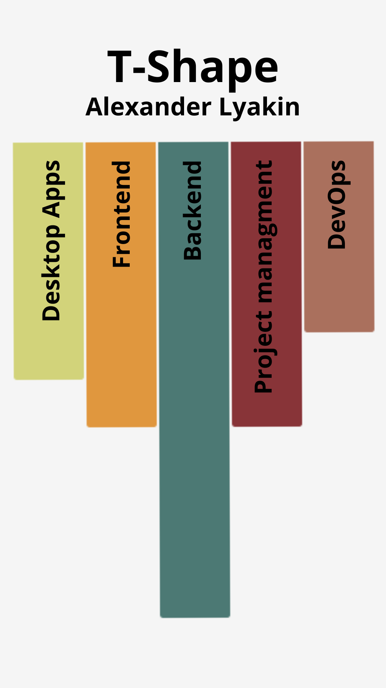

## About me

Backend developer specializing in API development (GraphQL, REST API) and high-load systems for mobile applications and websites. Developing packages on Packagist. Sharing educational content and helping junior developers improve their code through reviews and analysis. Experienced in project management in web studios.

### My Technology Stack (T-Shape)

<table>
<tr valign="top">
<td>

| **Desktop Apps** | **Frontend** | **Backend** | **Project Management** | **DevOps** |
|:-----------------:|:------------:|:-----------:|:---------------------:|:---------:|
|  |  |  |  |  |
|  |  |  |  |  |
|  |  |  |  |  |
|  |  |  |  |  |
|  |  |  |  | |
| | |  |  | |
| | |  | | |
| | |  | | |
| | |  | | |
| | |  | | |
| | |  | | |
| | |  | | |
| | |  | | |
| | |  | | |

</td>
<td>

  

</td>
</tr>
</table>
